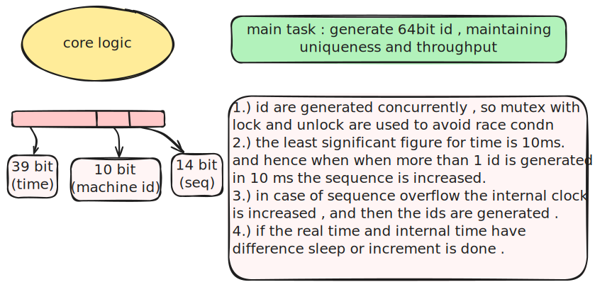

# Content

- [Core Logic](#core-logic)
- [Initialize](#initialize)
- [Program Flow](#program-flow)
- [References/credits](#references/credits)

## Core Logic

## Initialize

## Program Flow

## References/credits

- [Snowflake ID - Wikipedia](https://en.wikipedia.org/wiki/Snowflake_ID)
- [YouTube: Distributed ID Generation](https://www.youtube.com/watch?v=g3BV_holJK4)
- [YouTube: Snowflake algorithm](https://www.youtube.com/watch?v=aLYKd7h7vgY)
- Code assistant : [Supermaven](https://github.com/supermaven-inc/supermaven-nvim) -  (nvim plugin)
- Copilot Claude Sonnet 4 - For learning Go concepts deeply (structs, pointers, references)
- [Excalidraw Obsidian Plugin](https://github.com/zsviczian/obsidian-excalidraw-plugin) - SVG generation
